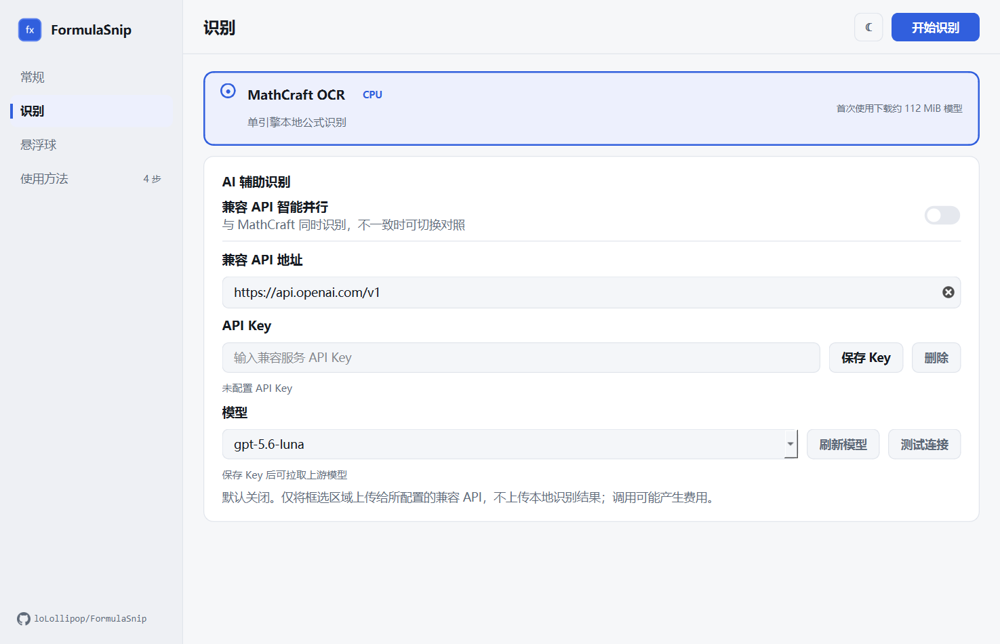

<p align="center">
  
</p>

<h1 align="center">FormulaSnip</h1>

<p align="center">框选屏幕上的数学公式，获得可编辑的 LaTeX 与 MathML。</p>

<p align="center">
  <a href="https://github.com/loLollipop/FormulaSnip/releases/latest"></a>
  <a href="https://github.com/loLollipop/FormulaSnip/releases"></a>
  <a href="LICENSE"></a>
  
</p>

<p align="center">
  <a href="https://github.com/loLollipop/FormulaSnip/releases/latest"><strong>下载最新版</strong></a>
  · <a href="#快速开始">快速开始</a>
  · <a href="https://github.com/loLollipop/FormulaSnip/issues">问题反馈</a>
</p>

<p align="center">
  
</p>

FormulaSnip 是面向 Windows 论文写作场景的公式截图识别工具。点击悬浮球框选公式，本地识别后即可校对电子公式，并复制到 Word、MathType、LaTeX 编辑器或其他支持 MathML 的软件中。

项目专注于**单个数学公式**，不处理整页文档、正文、表格或通用 OCR。

## 核心能力

| 能力 | 说明 |
| --- | --- |
| 本地公式识别 | 使用 MathCraft OCR 的 CPU 推理路径，默认不上传截图，无需独立显卡 |
| 电子公式校对 | 生成 SVG 预览，可在复制前检查并编辑 LaTeX 结果 |
| 论文写作输出 | 一键复制 LaTeX 或 MathML，适配 Word 与 MathType 工作流 |
| 悬浮球与系统托盘 | 截图、恢复悬浮球、打开设置、检查更新和退出均可快速完成 |
| 个性化外观 | 支持深色与浅色主题、圆环颜色和自定义悬浮球 Logo |
| 可选 AI 辅助 | 接入 OpenAI 兼容视觉接口，与本地引擎并行识别并切换对照 |

## 快速开始

1. 前往 [Releases](https://github.com/loLollipop/FormulaSnip/releases/latest)：安装版运行下载的 Setup 安装包，便携版解压 ZIP 后运行 `FormulaSnip.exe`。
2. 启动软件，点击“开始识别”，设置面板会收起并显示悬浮球。
3. 左键点击悬浮球，框选屏幕上的公式区域。
4. 在电子公式预览中校对结果，然后复制 LaTeX 或 MathML。

右键悬浮球可以打开设置或退出软件；截图时按 `Esc` 可以取消。复制任一格式后，结果面板会自动收起，方便立即粘贴。

| 粘贴目标 | 建议格式 |
| --- | --- |
| Word、MathType | 复制 MathML，在目标软件的公式编辑区域粘贴 |
| LaTeX 编辑器、Markdown | 复制 LaTeX，在公式环境中粘贴 |

## 下载与安装

| 文件 | 适用场景 |
| --- | --- |
| `FormulaSnip-v*-windows-x64-setup.exe` | 推荐。提供安装向导、快捷方式和卸载入口 |
| `FormulaSnip-v*-windows-x64.zip` | 便携使用。解压后运行 `FormulaSnip.exe` |

- 系统要求：Windows 10/11，x64。
- 首次识别需要联网下载约 112 MiB 的 MathCraft 公式模型，之后本地识别可离线使用。
- 当前安装包尚未进行代码签名，Windows SmartScreen 可能显示风险提示，请仅从本仓库下载。

安装版启动后会检查更新，可在应用内下载、校验并安装新版本，也可以选择稍后处理。便携版和源码版会打开 Release 页面，由用户手动更新。

## 界面

<p align="center">
  
  
</p>

<details>
<summary><strong>AI 辅助识别与隐私</strong></summary>

- AI 辅助默认关闭，由用户自行配置 OpenAI 兼容 API 地址、API Key 和模型。
- 启用后，本地 MathCraft 与远程视觉模型独立并行识别；结果不一致时可以切换对照。
- 远程服务只会收到本次框选的公式图片，不会收到本地识别结果。
- API Key 保存在 Windows 凭据管理器，不写入普通应用设置。
- 远程调用可能产生费用，图片处理规则和数据保留政策取决于所配置的服务提供商。
- AI 请求失败时，FormulaSnip 会保留本地识别结果。

</details>

## 使用边界

- 公式 OCR 无法保证完全正确，请在粘贴前对照原图校对。
- 复杂公式、低分辨率截图、模糊字符和紧密上下标更容易产生识别误差。

## 从源码运行

需要 Python 3.10 至 3.12 和 [uv](https://docs.astral.sh/uv/)：

```powershell
git clone https://github.com/loLollipop/FormulaSnip.git
cd FormulaSnip
uv sync --extra dev
uv run python -m formulasnip
```

运行检查：

```powershell
uv run pytest -q
uv run ruff check .
```

构建 Windows 便携包和安装包需要 [Inno Setup 6](https://jrsoftware.org/isinfo.php)：

```powershell
.\scripts\build_windows.ps1
```

## 参与项目

欢迎通过 [Issues](https://github.com/loLollipop/FormulaSnip/issues) 报告识别样例、交互问题或安装故障，也欢迎提交 Pull Request。反馈识别问题时，请附上原始公式截图和预期 LaTeX，避免包含隐私信息。

## 致谢

- [MathCraft OCR](https://github.com/SakuraMathcraft/LaTeXSnipper) 提供本地公式识别能力。
- [PySide6](https://doc.qt.io/qtforpython-6/) 提供 Windows 桌面界面支持。
- [latex2mathml](https://github.com/roniemartinez/latex2mathml) 用于生成 MathML 输出。

## 开源协议

FormulaSnip 采用 [GPL-3.0-only](LICENSE) 协议开源。第三方依赖和模型遵循各自的许可证，详见 [THIRD_PARTY_NOTICES.md](THIRD_PARTY_NOTICES.md)。
