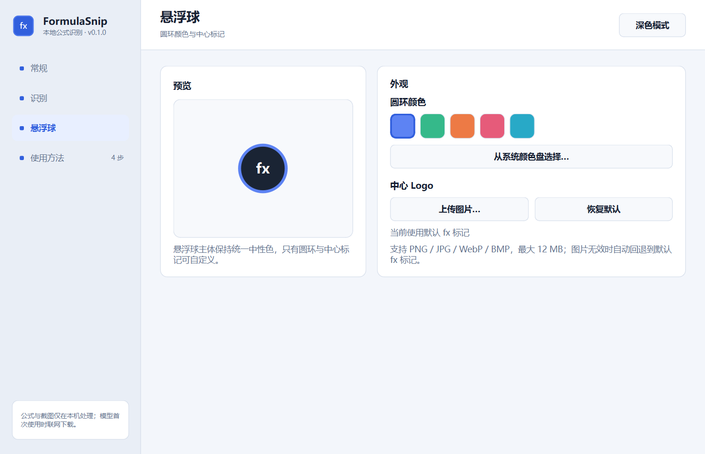
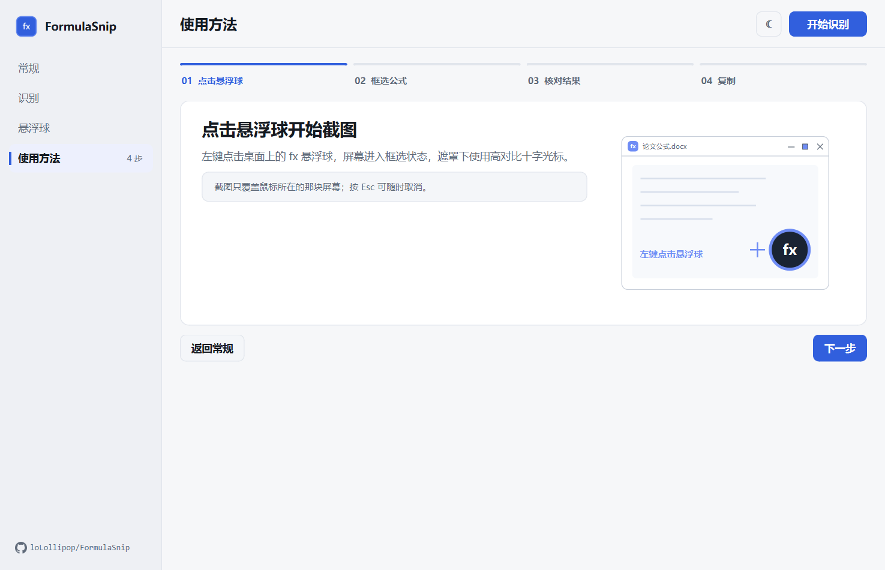

# FormulaSnip

FormulaSnip 是一个面向 Windows 论文写作场景的本地公式识别原型。它只处理用户截取的单个公式，不包含正文 OCR、表格或整页版面识别。

> 当前提供 V4 源码、Windows x64 Setup 安装版与便携版。Rapid 与 PP-FormulaNet-S 均包含在默认运行环境中；模型由各自官方组件在第一次识别时下载，之后可离线使用。

默认启动先显示完整设置中心，可查看四步使用教程；点击“开始识别公式”后进入悬浮模式：







当前支持：

- 可拖动、置顶并自动贴边的 `fx` 悬浮球；
- 点击悬浮球直接框选公式，完成后自动识别并展开轻量结果面板；
- 结果面板只显示最终采用的 SVG 电子公式，可直接复制 LaTeX 或 MathML，复制成功后自动收起；
- 右键悬浮球可打开设置或退出，结果面板也可重新截图；
- 设置中心只保留常规、识别、悬浮球和使用方法四个页面：常规页汇总启动开关、当前识别模式与两个识别引擎的安装状态，识别页用三张模式卡替代下拉框并说明智能复核的触发条件，悬浮球页提供实时预览，使用方法页是四步进度式教程；
- 顶部单按钮即时切换整个软件的深色/浅色主题；
- 悬浮球主体保持统一中性色，圆环支持推荐颜色和系统颜色盘；中心默认显示 `fx`，也可上传图片替换并恢复默认；
- 智能、快速和精确三种识别路径；
- 后台可比较 Rapid 与 PP-FormulaNet-S 的候选，但界面只呈现最终采用结果；
- 用 SVG 矢量排版成电子公式，放大仍保持清晰；
- 复制 LaTeX 或带 MathML MIME 的 MathML；
- 通过剪贴板粘贴到 Word、MathType 或其他支持 LaTeX/MathML 的编辑器。

## 安装与启动

### Windows Setup 安装版（推荐）

从 GitHub Releases 下载 `FormulaSnip-v0.2.0-windows-x64-setup.exe`，双击后按向导安装。安装器默认安装到当前用户的本机应用目录，不需要管理员权限，并会创建开始菜单入口和桌面快捷方式；也可以在安装向导中取消桌面快捷方式。

安装完成后可以从桌面或开始菜单启动，Windows“设置 > 应用 > 已安装的应用”中可正常卸载。安装版启动后每 12 小时在后台检查一次稳定版更新；发现新版本时可一键下载、校验并静默覆盖安装，也可在“设置中心 > 常规 > 检查更新”手动检查。源码版和便携版会打开发布页，不会擅自改变安装方式。后续版本沿用相同应用标识，可直接覆盖升级。卸载时会清理应用目录以及 Rapid 模型；Paddle 保存在用户缓存目录中的模型会保留，重新安装后可以继续复用。

当前 Windows 安装包尚未进行代码签名，首次下载或更新时 Microsoft Defender SmartScreen 可能显示风险提示。请只从本项目 GitHub Releases 获取安装包，并核对发布信息；应用内更新也会同时校验 GitHub 提供的大小和 SHA-256 摘要。

### Windows 便携版

从 GitHub Releases 下载 `FormulaSnip-v0.2.0-windows-x64.zip`，解压整个目录后双击 `FormulaSnip.exe`。不要只复制 EXE 文件；旁边的 `_internal` 目录是运行所需组件。

首次使用某个识别引擎时需要联网下载对应模型，完成后可以离线识别。模型权重不直接提交到源码仓库，也不打入发布压缩包。

### 从源码运行

默认安装会同时安装 RapidLaTeXOCR 与 PP-FormulaNet-S 所需依赖：

```powershell
uv sync
uv run python -m formulasnip
```

开发环境增加测试与代码检查工具：

```powershell
uv sync --extra dev
```

Rapid 与 Paddle 都会在第一次使用时联网下载各自的模型，下载完成后可以离线识别。默认安装两个引擎不代表每次都同时运行：智能模式仍先走 Rapid，只有命中复核条件时才启动 PP-FormulaNet-S。

## 三种识别路径

- **智能模式（推荐）**：先运行 Rapid；遇到积分、求和、极限、矩阵、低质量图片或疑似异常 LaTeX 时，再调用 PP-FormulaNet-S 复核并显示最终采用结果。
- **快速模式**：在设置中选择 RapidLaTeXOCR，只运行轻量 ONNX 后端。
- **精确模式**：在设置中选择 PP-FormulaNet-S，直接运行默认安装的 Paddle 后端。它不保证每个公式都比 Rapid 正确，因此仍需人工校对。

智能路由使用的是确定性风险规则，不是模型置信度，也不会把多个模型的神经网络直接拼接。普通、清晰公式即使两个引擎都已安装，也只运行 Rapid。

## 体积与速度实测

测试环境为本机 Windows、Python 3.12：

| 配置 | 安装后占用 | 运行特征 |
|---|---:|---|
| 默认双引擎环境 | 约 1,506 MiB（1.47 GiB） | Rapid 快速识别，必要时 Paddle 复核 |
| RapidLaTeXOCR 模型 | 上表已包含；模型约 170.7 MiB | warm 通常约 1–2 秒 |
| PP-FormulaNet-S 模型 | 上表已包含；模型约 227.4 MiB | 首次初始化约 9.6 秒，warm 约 0.67–0.76 秒 |

这些是开发环境与模型缓存的实测占用，不等于发布 ZIP 的压缩大小。不同 Python、依赖版本和模型缓存位置会略有变化。

## 基本使用

1. 启动后在设置中心选择识别模式、圆环颜色和 Logo；需要时打开左侧“快速上手”。
2. 点击“开始识别公式”，设置面板收起，只保留悬浮球。
3. 左键点击悬浮球并框选单个公式；Esc 可以取消，遮罩下使用高对比十字光标。
4. 识别完成后，悬浮球旁展开带白边的电子公式结果。
5. 核对后复制 LaTeX 或 MathML；复制成功后结果面板自动收起，可直接到 Word/MathType 粘贴。
6. 右键悬浮球可以重新打开设置或退出软件。

FormulaSnip 通过 LaTeX/MathML 剪贴板与 Word、MathType 交换公式，不调用 MathType 私有接口，也不直接修改 Word 文档。

## 许可证

FormulaSnip 自有源代码采用 **GNU General Public License v3.0 only（GPL-3.0-only）**，详见 [LICENSE](LICENSE)。

- 允许使用、研究、修改和再分发；分发本软件或其修改版本时须遵守 GPLv3 的源码提供、版权与许可证保留等要求；
- GPL 不限制商业使用，但任何再分发仍须满足 GPLv3；
- 第三方依赖与首次运行时下载的模型权重仍适用各自许可证，见 [THIRD_PARTY_NOTICES.md](THIRD_PARTY_NOTICES.md)。

## 构建 Windows 发行包

```powershell
powershell -ExecutionPolicy Bypass -File scripts\build_windows.ps1
```

需要先安装 [Inno Setup 6](https://jrsoftware.org/isinfo.php)，也可以运行 `winget install --id JRSoftware.InnoSetup --exact`。构建脚本会安装 `packaging` 依赖、生成 `dist\FormulaSnip\FormulaSnip.exe`，并同时创建：

- `dist\FormulaSnip-v0.2.0-windows-x64-setup.exe`：带安装向导、快捷方式和卸载入口的推荐安装版；
- `dist\FormulaSnip-v0.2.0-windows-x64.zip`：无需安装的便携版。

应用本体仍采用目录模式打包，避免大型 AI 运行库在每次启动时临时解压。只需要从已有 `dist\FormulaSnip` 目录重建安装器时，可运行 `powershell -ExecutionPolicy Bypass -File scripts\build_installer.ps1`。

上一版 Windows x64 的历史实测为：ZIP 约 295.5 MiB，解压后约 799.0 MiB；首次使用下载两个模型后还会增加约 398 MiB。v0.2.0 的最终体积以 Releases 页面为准。

## 基准与开发命令

```powershell
uv run python -m pytest
uv run ruff check .
uv run python scripts\benchmark_recognition.py --backend rapid --runs 3 --output artifacts\benchmark-rapid.json
uv run python scripts\benchmark_recognition.py --backend auto --runs 3 --output artifacts\benchmark-auto.json
```

`benchmarks/manifest.json` 会校验样本路径、SHA-256、来源和许可证。当前仅有两张 CC0 合成样本，用于验证基准框架和回归路径，不能据此宣称总体准确率提高了某个百分比。

## 当前边界

- 截图功能截取鼠标所在屏幕，不自动寻找整页中的公式。
- 本地预览使用 Matplotlib MathText 生成 SVG 矢量公式，不覆盖全部 LaTeX 宏；预览失败不影响复制结果。
- 质量规则可发现括号不配对、裸 `frac/sqrt`、重复运算符、异常长度和重复片段，但无法判断所有“语法正确、数学含义错误”的结果。
- Rapid 权重未见单独的再分发许可说明，因此当前发行包不直接捆绑该权重，由上游组件在首次使用时下载。
- 尚未在真实 Word/MathType、多种 Office 版本和异 DPI 多显示器环境中完成兼容性验收。

项目调研、Star/Issue 历史、模型比较和本机实测见 [OPTIMIZATION_REPORT.md](OPTIMIZATION_REPORT.md)，交付范围见 [PROJECT_SUMMARY.md](PROJECT_SUMMARY.md)。
