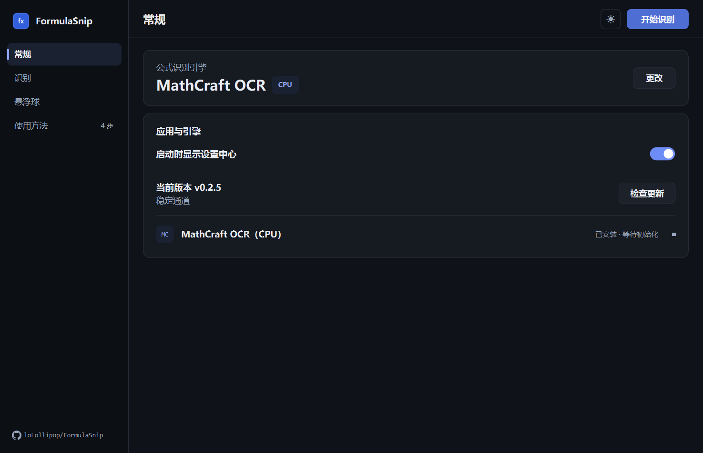
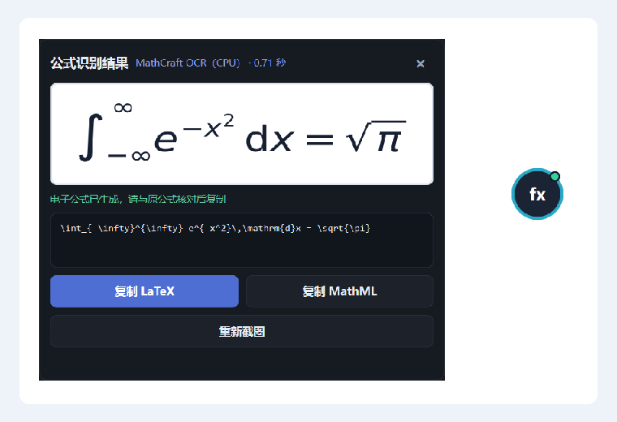

# FormulaSnip

FormulaSnip 是面向 Windows、Word 和 MathType 工作流的本地公式截图识别工具。

## 功能

- 点击悬浮球框选单个公式；
- 使用 MathCraft OCR 0.3.1 的 CPU 推理路径在本地识别；
- 可选接入 OpenAI 兼容视觉模型，与本地识别智能并行（默认关闭，用户自备 API Key）；
- 显示 SVG 电子公式预览，方便识别后校对；
- 一键复制 LaTeX 或 MathML，复制后自动收起结果面板；
- 支持从 Windows 系统托盘开始识别、恢复悬浮球、打开设置或检查更新；
- 支持深色与浅色主题、自定义悬浮球圆环颜色和中心 Logo；
- 安装版支持在应用内检查并安装更新。

## 界面预览





## 安装

前往 [GitHub Releases](https://github.com/loLollipop/FormulaSnip/releases/latest) 下载最新版本：

- `FormulaSnip-v0.2.6-windows-x64-setup.exe`：安装版，提供安装向导、桌面快捷方式和卸载入口；
- `FormulaSnip-v0.2.6-windows-x64.zip`：便携版，解压后运行 `FormulaSnip.exe`。

首次识别需要联网下载 MathCraft 公式模型（约 112 MiB），下载完成后可离线使用。当前安装包尚未进行代码签名，Windows SmartScreen 可能显示风险提示，请仅从本仓库下载。

## 使用方法

1. 启动 FormulaSnip，点击“开始识别”；
2. 左键点击悬浮球，框选需要识别的公式；
3. 在电子公式预览中核对识别结果；
4. 复制 LaTeX 或 MathML；
5. 粘贴到 Word、MathType 或其他公式编辑器。

右键悬浮球可以重新打开设置或退出软件，按 `Esc` 可以取消截图。

FormulaSnip 固定使用 MathCraft OCR（CPU）。公式 OCR 无法保证完全正确，所有结果都应在粘贴前对照原图校对。

AI 辅助识别可在“设置 → 识别”中配置兼容 API 地址、拉取上游模型并测试连接。启用后，MathCraft 与 AI 会同时识别；结果不一致时可在结果窗切换对照。API Key 保存在 Windows 凭据管理器，仅把本次框选的公式截图发送给所配置的服务，可能产生 API 费用，失败时自动保留本地结果。

## 从源码运行

需要 Python 3.10–3.12 和 [uv](https://docs.astral.sh/uv/)：

```powershell
uv sync
uv run python -m formulasnip
```

## 开源协议

FormulaSnip 采用 [GPL-3.0-only](LICENSE) 协议开源。第三方依赖与模型遵循各自的许可证，详见 [THIRD_PARTY_NOTICES.md](THIRD_PARTY_NOTICES.md)。
